# CloudThrift

Event-Driven Azure Infrastructure & FinOps Orchestrator

**Al-Jawharah Mohammed Alsumayri**

Cloud Infrastructure & Automation  
Azure • Terraform • Python • Infrastructure as Code • FinOps • SRE Concepts
---

# Overview

I built CloudThrift, an event-driven autonomous Azure infrastructure and FinOps orchestration platform designed to monitor cloud workloads, evaluate infrastructure conditions, optimize resource capacity, detect cloud waste, and execute controlled Azure operations automatically.

The project addresses two common cloud engineering challenges:

1. Maintaining enough infrastructure capacity to handle workload demand.
2. Reducing unnecessary cloud spending caused by over-provisioned or abandoned resources.

CloudThrift continuously collects telemetry from Azure, processes the collected data through a policy-driven decision engine, evaluates the financial impact of infrastructure changes, and executes approved operations through the Azure SDK.

The platform supports automatic Virtual Machine Scale Set scaling, FinOps-based capacity optimization, unused resource detection, safe cleanup simulation, real resource deletion, event-driven execution, monitoring, and audit logging.

Terraform is used to provision the Azure infrastructure, while Python is responsible for monitoring, decision-making, execution, FinOps analysis, waste detection, cleanup validation, and operational auditing.

---

# Project Motivation

Cloud environments are dynamic.

Workload demand can increase suddenly, requiring additional compute capacity. At the same time, unused infrastructure can remain active and continue generating unnecessary costs.

Managing these conditions manually may result in:

- Delayed response to workload changes
- Over-provisioned infrastructure
- Unused Azure resources
- Higher operational costs
- Inconsistent infrastructure decisions
- Limited visibility into automated operations

CloudThrift was created to demonstrate how infrastructure operations can be managed through a structured autonomous workflow.

Instead of performing every operation manually, the platform follows this cycle:

```text
Observe
   ↓
Analyze
   ↓
Decide
   ↓
Estimate Cost
   ↓
Execute
   ↓
Optimize
   ↓
Audit
```

---

# Architecture

```text
                     Azure Cloud Environment
                               |
                               v
                     Telemetry Collector
                               |
                               v
                      Decision Engine
                               |
             +-----------------+-----------------+
             |                                   |
             v                                   v
     Scaling Action Selector              FinOps Optimizer
             |                                   |
             +-----------------+-----------------+
                               |
                               v
                       Action Executor
                               |
                               v
                  Azure VM Scale Set Operations

                               |
                               v

                     Resource Optimizer
                               |
                               v
                    Cloud Waste Detection
                               |
                               v
                     Cleanup Executor
                               |
                               v
                Azure Resource Cleanup Actions

                               |
                               v
                        Audit Logger
```

---

# Main Components

## Telemetry Collector

The Telemetry Collector gathers live infrastructure information from Azure Monitor.

The collected values include:

- CPU utilization
- Network throughput
- Request volume
- Current VM Scale Set capacity
- Budget utilization
- Environment name
- Collection timestamp

Example:

```json
{
  "cpu_percent": 0.18,
  "network_mbps": 0.0158,
  "requests_per_minute": 0,
  "current_instances": 1,
  "budget_used_percent": 0.0,
  "environment": "development",
  "source": "azure-monitor"
}
```

The telemetry layer provides the operational state required by the decision engine and FinOps components.

---

## Cloud State Evaluation

Raw monitoring values alone are not enough to make safe infrastructure decisions.

CloudThrift creates a workload state that also includes:

- High CPU duration
- High network duration
- High request duration
- Low CPU duration
- Low network duration
- Low request duration
- Time since the last scale-out operation
- Time since the last scale-in operation
- Number of scaling actions during the last hour

This allows the system to evaluate sustained behavior instead of reacting to a single short-lived metric spike.

---

## Policy-Driven Decision Engine

The Decision Engine evaluates the current workload against a JSON-based scaling policy.

The policy defines:

- Minimum instance count
- Normal maximum capacity
- Emergency maximum capacity
- Scale-out thresholds
- Scale-in thresholds
- Required number of signals
- Evaluation periods
- Cooldown periods
- Maximum actions per hour
- Budget guardrails
- Production protection
- Dry-run behavior

The engine can produce decisions such as:

```text
SCALE_OUT
SCALE_IN
NO_ACTION
BLOCKED_BY_BUDGET
BLOCKED_BY_COOLDOWN
BLOCKED_BY_PROTECTION
POLICY_DISABLED
INVALID_STATE
```

Each decision includes:

- Current capacity
- Target capacity
- Triggered signals
- Blocked signals
- Decision reason
- Confidence score
- Dry-run state
- Timestamp

---

# Autonomous Scale-Out

CloudThrift can automatically increase Azure VM Scale Set capacity when sustained workload demand is detected.

During testing, the system detected two independent high workload signals:

```text
CPU_HIGH: 85%
REQUESTS_HIGH: 1500/min
```

The Decision Engine analyzed the collected telemetry and selected a **Scale-Out** action, increasing the Azure VM Scale Set capacity from **1** to **2 instances**.

### Decision Engine Selected Action

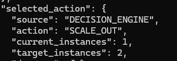

### Decision Execution

CloudThrift executed the Scale-Out action and successfully updated the Azure VM Scale Set capacity from **1** to **2 instances**.

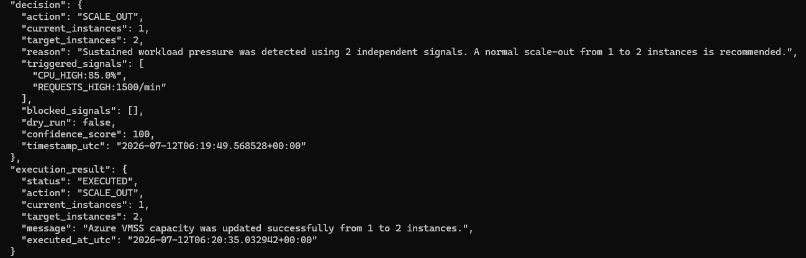

### Azure VM Scale Set After Scale-Out

Azure confirmed that the VM Scale Set successfully scaled from **1** to **2 running instances**, verifying that the autonomous Scale-Out operation completed successfully.

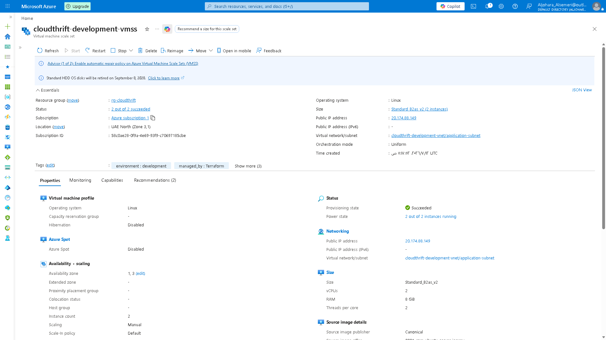

---

# Autonomous Scale-In

CloudThrift can automatically reduce Azure VM Scale Set capacity when workload demand remains low, helping reduce cloud costs while maintaining service availability.

During testing, the system detected multiple low utilization signals:

```text
CPU_LOW: 5%
NETWORK_LOW: 2 Mbps
REQUESTS_LOW: 10/min
```

### Decision Engine Selected Action

The Decision Engine analyzed the collected telemetry and selected a **Scale-In** action, reducing the Azure VM Scale Set capacity from **2** to **1 instance**.

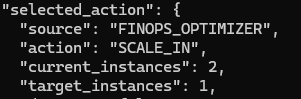

```json
{
  "action": "SCALE_IN",
  "current_instances": 2,
  "target_instances": 1,
  "confidence_score": 100
}
```

### Decision Execution

CloudThrift executed the Scale-In action and successfully updated the Azure VM Scale Set capacity from **2** to **1 instance**.

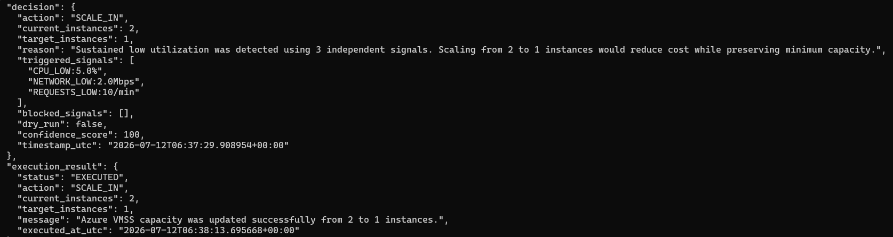

### Azure VM Scale Set After Scale-In

Azure confirmed that the Virtual Machine Scale Set successfully returned to its protected minimum capacity of **one running instance**, reducing infrastructure cost while maintaining application availability.

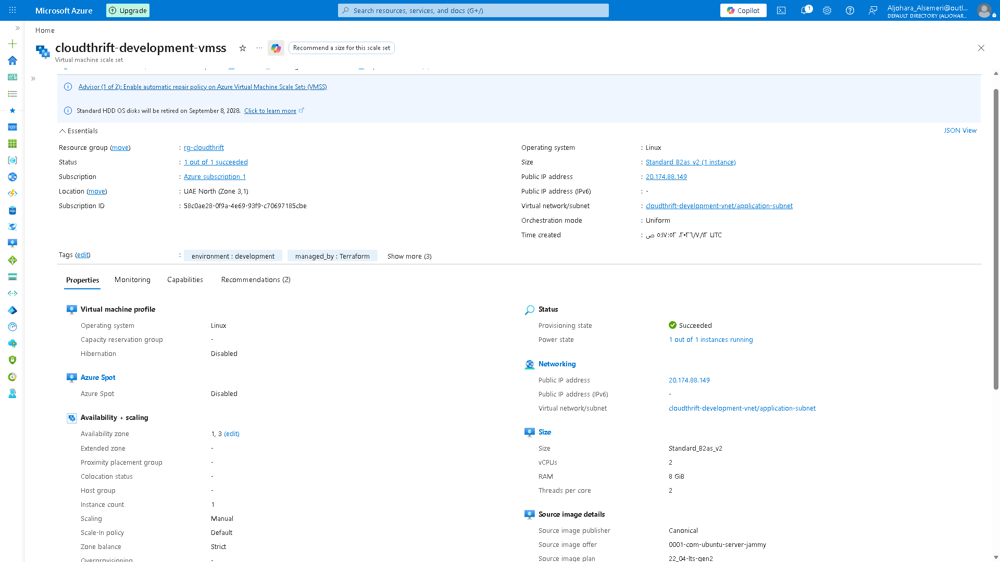

---

# FinOps Optimization

CloudThrift integrates financial awareness into infrastructure decisions.

The FinOps component evaluates:

- Current VM Scale Set capacity
- Current hourly cost
- Target hourly cost
- Hourly cost change
- Estimated daily cost change
- Estimated monthly cost change
- Minimum capacity protection
- Workload observation duration

During testing, CloudThrift reduced the environment from two instances to one instance.

### Cost Estimation

Before making any optimization decision, CloudThrift estimates the financial impact of scaling actions. The FinOps Optimizer compares the current infrastructure cost with the projected cost after optimization and calculates the expected savings.

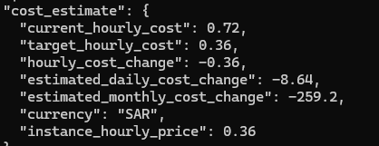

Example cost estimate:

```json
{
  "current_hourly_cost": 0.72,
  "target_hourly_cost": 0.36,
  "hourly_cost_change": -0.36,
  "estimated_daily_cost_change": -8.64,
  "estimated_monthly_cost_change": -259.2,
  "currency": "SAR"
}
```

This demonstrated an estimated monthly reduction of approximately:

```text
259.2 SAR
```

### Waste Detection

Before performing cleanup actions, CloudThrift analyzes Azure resources to detect infrastructure waste. During testing, the platform successfully identified unused Azure resources that were eligible for automated cleanup.

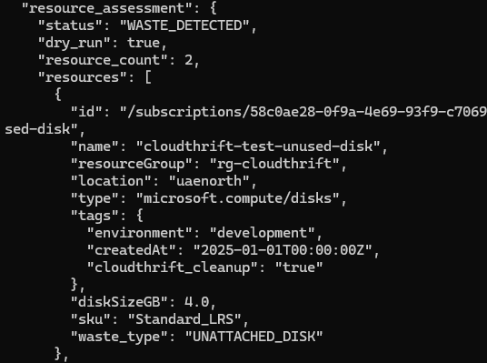

### Automated Cleanup Execution

After confirming that the detected resource was safe to remove, CloudThrift automatically executed the cleanup operation. Azure confirmed that the unused managed disk was successfully deleted.

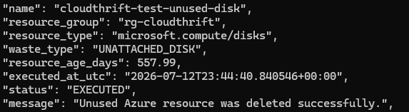

### Minimum Capacity Protection

The FinOps Optimizer also protects the minimum required infrastructure capacity.

When the VM Scale Set is already running at one instance, the platform returns:

```text
MINIMUM_CAPACITY
```

and does not attempt further Scale-In operations, ensuring that service availability is preserved while preventing unnecessary optimization actions.

---

# Scaling Safety Controls

CloudThrift includes several controls to avoid unstable or unsafe scaling behavior.

These controls include:

- Minimum capacity protection
- Normal and emergency capacity limits
- Sustained signal requirements
- Scale-out cooldown
- Scale-in cooldown
- Maximum actions per hour
- Budget usage limits
- Production environment protection
- Dry-run mode
- Confidence scoring

These controls help prevent rapid scaling loops, unnecessary operations, and accidental capacity reduction.

---

# Cost Estimator

Before an infrastructure action is executed, the platform estimates its financial effect.

The Cost Estimator calculates:

- Current hourly infrastructure cost
- Target hourly infrastructure cost
- Hourly difference
- Daily difference
- Monthly difference
- Currency
- Cost per VM instance

This ensures that scaling operations are evaluated from both an operational and financial perspective.

---

# Action Executor

The Action Executor is responsible for applying approved scaling decisions to Azure.

It supports:

```text
SCALE_OUT
SCALE_IN
NO_ACTION
```

For real scaling operations, the executor communicates with Azure through the Azure SDK for Python and updates VM Scale Set capacity.

The executor returns a structured result containing:

- Status
- Action
- Current capacity
- Target capacity
- Execution message
- Execution timestamp

Example:

```json
{
  "status": "EXECUTED",
  "action": "SCALE_OUT",
  "current_instances": 1,
  "target_instances": 2,
  "message": "Azure VMSS capacity was updated successfully from 1 to 2 instances."
}
```

When no infrastructure change is required, the executor returns:

```text
SKIPPED
```

instead of performing an unnecessary Azure operation.

---

# Cloud Waste Detection

CloudThrift includes a Resource Optimizer that scans the Azure subscription for unused resources.

Azure Resource Graph is used to detect supported waste categories.

The implemented detection methods include:

- Unattached managed disks
- Unassociated public IP addresses
- Unused network interfaces
- Unused network security groups
- Unused route tables
- Empty load balancers
- Empty application gateways

Each detected resource is classified with a waste type.

Examples:

```text
UNATTACHED_DISK
UNASSOCIATED_PUBLIC_IP
UNUSED_NETWORK_INTERFACE
UNUSED_NETWORK_SECURITY_GROUP
UNUSED_ROUTE_TABLE
EMPTY_LOAD_BALANCER
EMPTY_APPLICATION_GATEWAY
```

Example detection result:

```json
{
  "status": "WASTE_DETECTED",
  "dry_run": true,
  "resource_count": 2
}
```

During testing, CloudThrift successfully detected:

```text
1 Unattached Managed Disk
1 Unassociated Public IP Address
```

---

# Resource Cleanup Safety

Cloud resource deletion is a high-risk operation.

For this reason, CloudThrift does not delete every detected resource automatically.

Before deletion, the Cleanup Executor verifies several safety conditions.

A resource must:

- Belong to an allowed environment
- Contain the required cleanup tag
- Not contain the protected tag
- Not belong to a protected resource group
- Be older than the minimum allowed age
- Have a known creation time
- Still be unused during live validation
- Pass the cleanup policy
- Run with deletion enabled
- Run outside dry-run mode

Required cleanup tag:

```text
cloudthrift_cleanup=true
```

Example environment tag:

```text
environment=development
```

Optional protection tag:

```text
cloudthrift_protected=true
```

Resources with the protection tag are blocked from deletion.

---

# Resource Age Validation

CloudThrift verifies resource age before cleanup.

Resource creation time can be supplied through metadata such as:

```text
createdAt=2025-01-01T00:00:00Z
```

The cleanup engine calculates the age of the resource and compares it against the minimum age specified in the cleanup policy.

This prevents recently created resources from being deleted accidentally.

---

# Live Resource Validation

Before executing deletion, CloudThrift queries Azure again to confirm that the detected condition is still valid.

Examples:

For a managed disk:

```text
Managed disk is still unattached.
```

For a public IP:

```text
Public IP is still unassociated.
```

The resource is deleted only if the live Azure state confirms that it is still unused.

This protects the system from deleting a resource that became associated after the initial detection stage.

---

# Dry-Run Cleanup Simulation

CloudThrift supports a dry-run mode for cleanup validation.

In dry-run mode, the system:

- Detects unused resources
- Evaluates tags
- Verifies resource age
- Performs live validation
- Approves the cleanup decision
- Prevents actual deletion

Example result:

```json
{
  "status": "SIMULATED",
  "message": "Cleanup approved and live validation passed, but dry-run prevented deletion."
}
```

During testing:

```text
Detected Resources: 2
Simulated Resources: 2
Blocked Resources: 0
Failed Resources: 0
```

This demonstrated that both test resources passed the safety controls before real deletion was enabled.

---

# Automated Resource Cleanup

After dry-run validation succeeded, the cleanup policy was changed to execution mode.

CloudThrift then deleted both validated resources.

Execution result:

```json
{
  "status": "EXECUTED",
  "dry_run": false,
  "executed_count": 2,
  "blocked_count": 0,
  "simulated_count": 0,
  "failed_count": 0
}
```

Deleted resource types:

```text
UNATTACHED_DISK
UNASSOCIATED_PUBLIC_IP
```

Managed disk result:

```text
Unused Azure resource was deleted successfully.
```

Public IP result:

```text
Unused Azure resource was deleted successfully.
```

The full cleanup operation completed without blocked or failed resources.

---

# Post-Cleanup Validation

After the resources were deleted, CloudThrift ran another assessment.

Result:

```json
{
  "status": "CLEAN",
  "resource_count": 0,
  "resources": []
}
```

This confirmed that no supported waste resources remained after the cleanup operation.

---

# Autonomous Cleanup Cycle Summary

CloudThrift produces a summary after each orchestration cycle.

Example:

```json
{
  "scaling_action": "NO_ACTION",
  "scaling_execution_status": "SKIPPED",
  "orphaned_resources_detected": 2,
  "cleanup_status": "EXECUTED",
  "cleanup_executed_count": 2,
  "cleanup_simulated_count": 0,
  "cleanup_blocked_count": 0,
  "cleanup_failed_count": 0
}
```

This summary provides a clear operational view of both scaling and cleanup activity.

---

# Event-Driven Automation

CloudThrift was deployed through Azure Functions.

The Function App includes:

```text
cloudthrift_timer
cloudthrift_event_handler
```

The timer trigger runs the scheduled orchestration cycle.

The Event Grid trigger allows the platform to respond to Azure events.

Deployment verification included:

```text
Remote build succeeded
Syncing triggers
```

### Azure Function Deployment

CloudThrift was successfully deployed to Azure Functions. The deployment completed successfully, and Azure synchronized the function triggers, making the serverless automation ready for execution.

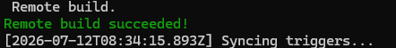

Azure confirmed the available functions:

```text
cloudthrift_timer          - TimerTrigger
cloudthrift_event_handler  - EventGridTrigger
```

This allows CloudThrift to operate as a scheduled and event-driven automation platform rather than only as a locally executed Python script.

---

# Scheduled Orchestration Cycle

The scheduled cycle performs the following sequence:

```text
Collect Azure Metrics
        ↓
Build Cloud State
        ↓
Evaluate Scaling Policy
        ↓
Run FinOps Assessment
        ↓
Select Final Action
        ↓
Estimate Cost Impact
        ↓
Execute Azure Action
        ↓
Detect Resource Waste
        ↓
Run Cleanup Workflow
        ↓
Write Audit Record
        ↓
Return Cycle Summary
```

A normal low-workload cycle may produce:

```text
Action: NO_ACTION
Execution: SKIPPED
Cleanup: NO_CLEANUP_REQUIRED
```

This is a valid result because the platform is designed to act only when an infrastructure change is justified.

---

# Monitoring and Observability

CloudThrift integrates with:

- Azure Monitor
- Application Insights
- Azure Function Logs
- Local structured audit logs

Azure Monitor provides VM Scale Set infrastructure metrics.

Application Insights provides visibility into:

- Function execution
- Host activity
- Trigger execution
- Runtime behavior
- Operational logs

The platform also writes structured logs for:

- Telemetry collection
- Workload evaluation
- Cost estimation
- Infrastructure decisions
- Scaling actions
- Cleanup actions
- Audit events

### Azure Monitor Metrics

CloudThrift continuously collects Azure Monitor metrics, including CPU utilization, to evaluate infrastructure health and determine whether autonomous scaling actions are required.

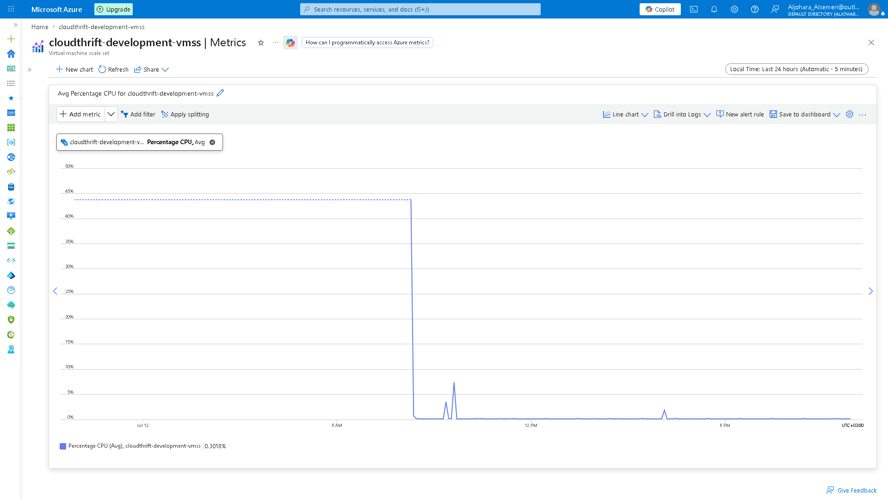

### Azure Function Runtime Logs

Application Insights and Azure Function Logs confirm that CloudThrift executes successfully inside Azure Functions. Runtime events, host initialization, timer execution, and operational traces are continuously recorded for monitoring and troubleshooting.


### Autonomous Orchestration

CloudThrift continuously executes autonomous orchestration cycles. During each cycle, the platform collects Azure telemetry, evaluates workload conditions, estimates infrastructure cost, records audit events, and determines whether scaling actions are required.

The orchestration log below demonstrates a complete autonomous execution cycle, including telemetry collection, workload evaluation, cost analysis, infrastructure decision making, and structured audit logging.

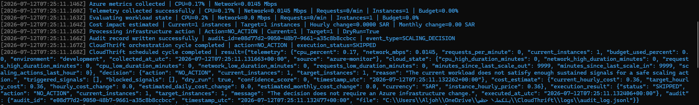

---

# Audit Logging

Every important operation is written to the audit log.

Audit records include:

- Audit ID
- Event type
- Timestamp
- Decision information
- Execution result
- Cleanup result
- Log file location

Supported audit event examples include:

```text
SCALING_DECISION
RESOURCE_CLEANUP_SIMULATION
RESOURCE_CLEANUP
```

Example:

```json
{
  "event_type": "RESOURCE_CLEANUP",
  "audit_id": "generated-unique-id",
  "timestamp_utc": "UTC timestamp"
}
```

This creates traceability for automated infrastructure operations.

---

# Technologies

- Microsoft Azure
- Terraform
- Python
- Azure Functions
- Azure Event Grid
- Azure Virtual Machine Scale Sets
- Azure Monitor
- Application Insights
- Azure Resource Graph
- Azure Identity
- Azure SDK for Python
- Azure Virtual Network
- Azure Network Security Groups
- Azure Load Balancer
- JSON Policy Files
- Ubuntu Linux
- PowerShell
- Git
- GitHub

---

# Infrastructure as Code

Terraform is used to provision and manage the Azure infrastructure.

The infrastructure includes:

- Resource Group
- Virtual Network
- Subnet
- Network Security Group
- Public IP
- Azure Load Balancer
- Virtual Machine Scale Set
- Supporting Azure resources

Using Terraform provides:

- Repeatable deployments
- Version-controlled infrastructure
- Consistent configuration
- Easier infrastructure updates
- Reduced manual portal configuration

### Azure Resource Group Overview

CloudThrift provisions all Azure resources through Terraform into a single resource group, including the VM Scale Set, Load Balancer, Virtual Network, Function App, Storage Account, and monitoring components.

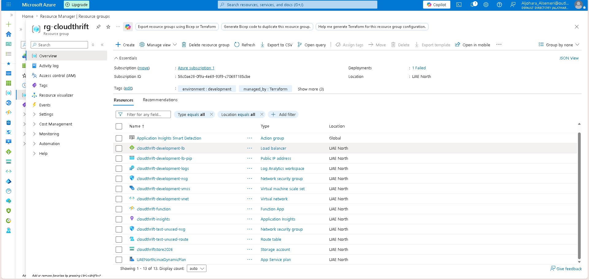

---

# Project Structure

```text
CloudThrift/
│
├── azure_function/
│   ├── function_app.py
│   ├── orchestrator.py
│   ├── telemetry_collector.py
│   ├── decision_engine.py
│   ├── finops_optimizer.py
│   ├── cost_estimator.py
│   ├── action_executor.py
│   ├── resource_optimizer.py
│   ├── cleanup_executor.py
│   └── audit_logger.py
│
├── infrastructure/
│   └── Terraform configuration files
│
├── policies/
│   ├── scaling_policy.json
│   └── cleanup_policy.json
│
├── logs/
│   └── audit_log.jsonl
│
├── screenshots/
│   └── Project validation evidence
│
├── tests/
│   └── Scaling and cleanup test scenarios
│
└── README.md
```

---

# Workflow

1. Terraform provisions the Azure infrastructure.

2. Azure Monitor collects live workload metrics.

3. The Telemetry Collector retrieves CPU, network, request, capacity, and budget information.

4. CloudThrift builds the workload state.

5. The Decision Engine evaluates scaling thresholds and safety controls.

6. The FinOps Optimizer evaluates capacity and cost efficiency.

7. The final infrastructure action is selected.

8. The Cost Estimator calculates the financial impact.

9. The Action Executor updates Azure VM Scale Set capacity when required.

10. The Resource Optimizer scans Azure for unused resources.

11. The Cleanup Executor evaluates tags, age, policies, and live Azure state.

12. Dry-run mode simulates approved cleanup operations.

13. Execution mode removes validated unused resources.

14. The Audit Logger records the complete cycle.

15. Azure Functions run the process through scheduled and event-driven triggers.

---

# Testing Scenarios

## Normal Workload Test

Expected behavior:

```text
Decision: NO_ACTION
Execution: SKIPPED
```

Purpose:

Verify that CloudThrift does not make unnecessary infrastructure changes.

---

## Scale-Out Test

Input conditions:

```text
High CPU
High Request Volume
Sustained Signal Duration
```

Result:

```text
1 Instance → 2 Instances
Status: EXECUTED
```

---

## Scale-In Test

Input conditions:

```text
Low CPU
Low Network Usage
Low Request Volume
Sustained Observation Period
```

Result:

```text
2 Instances → 1 Instance
Status: EXECUTED
```

---

## Minimum Capacity Protection Test

Condition:

```text
Current Capacity: 1 Instance
```

Result:

```text
Status: MINIMUM_CAPACITY
No scale-in operation executed
```

---

## Waste Detection Test

Created test resources:

```text
Unattached Managed Disk
Unassociated Public IP
```

Result:

```text
Status: WASTE_DETECTED
Resource Count: 2
```

---

## Cleanup Dry-Run Test

Result:

```text
Simulated Count: 2
Blocked Count: 0
Failed Count: 0
```

No resources were deleted during this stage.

---

## Real Cleanup Test

Result:

```text
Executed Count: 2
Blocked Count: 0
Failed Count: 0
```

Both Azure resources were deleted successfully.

---

## Post-Cleanup Test

Result:

```text
Status: CLEAN
Resource Count: 0
```

---

# Results

CloudThrift successfully demonstrated:

- Live Azure telemetry collection
- Policy-driven scaling decisions
- Real VM Scale Set scale-out
- Real VM Scale Set scale-in
- Minimum capacity protection
- Cost impact estimation
- Estimated monthly infrastructure savings
- Detection of unused Azure resources
- Safe cleanup simulation
- Live validation before deletion
- Real managed disk deletion
- Real public IP deletion
- Post-cleanup verification
- Scheduled Azure Function execution
- Event Grid trigger deployment
- Application Insights integration
- Structured audit logging

---

# Key Validation Results

```text
Scale-Out:
1 → 2 Instances
Status: EXECUTED
```

```text
Scale-In:
2 → 1 Instance
Status: EXECUTED
```

```text
Estimated Monthly Cost Reduction:
259.2 SAR
```

```text
Waste Resources Detected:
2
```

```text
Waste Resources Deleted:
2
```

```text
Blocked Cleanup Operations:
0
```

```text
Failed Cleanup Operations:
0
```

```text
Final Resource Assessment:
CLEAN
```

---


---

# Challenges

## Safe Resource Deletion

One of the main challenges was ensuring that detected resources were truly safe to delete.

A resource may appear unused during one query but become associated before the deletion operation.

To handle this, I implemented:

- Required cleanup tags
- Protected tags
- Environment validation
- Protected resource groups
- Minimum resource age
- Creation-time validation
- Live Azure validation before deletion
- Dry-run simulation
- Structured execution results

---

## Azure SDK Resource States

Azure SDK values may be returned as enumeration strings instead of plain text.

For example, an unattached managed disk state could appear as:

```text
DiskState.UNATTACHED
```

instead of:

```text
unattached
```

I normalized the returned value before comparing it, allowing the cleanup engine to validate managed disk state correctly.

---

## Policy Consistency

Another challenge was ensuring that detection method names matched the action names in the cleanup policy.

The project uses JSON policy files so behavior can be updated without changing the main automation logic.

---

## Resource Creation Time

Azure Resource Graph did not always provide a usable creation timestamp.

To maintain safe cleanup behavior, CloudThrift blocks resources with unknown age when the policy requires known creation time.

For controlled testing, resource creation metadata was supplied through the `createdAt` tag.

---

## Safe Scaling Decisions

The platform needed to avoid scaling based on temporary metric changes.

To solve this, the decision process uses:

- Sustained signal duration
- Multiple independent signals
- Cooldown controls
- Capacity limits
- Budget guardrails
- Confidence scoring

---

# What I Learned

Through CloudThrift, I gained hands-on experience with:

- Azure Infrastructure as Code using Terraform
- Azure VM Scale Set management
- Azure Monitor metrics collection
- Application Insights
- Azure Functions
- Event Grid triggers
- Azure Resource Graph queries
- Azure SDK for Python
- Policy-driven automation
- Infrastructure scaling logic
- FinOps cost modeling
- Cloud waste detection
- Safe cloud resource cleanup
- Dry-run validation
- Resource tagging strategies
- Live cloud-state verification
- Audit logging
- Event-driven architecture
- Reliability and operational safety concepts
- Debugging Azure SDK responses
- Designing modular cloud automation systems

---

# Project Objectives

The main objective of CloudThrift was to build a practical Azure automation platform that combines:

- Infrastructure monitoring
- Policy-based decision making
- Automated scaling
- Cost optimization
- Resource waste detection
- Safe cleanup execution
- Event-driven workflows
- Operational auditing

The project demonstrates how cloud infrastructure operations can be automated while still maintaining safety, cost awareness, and visibility.

---

# Future Improvements

Possible future improvements include:

- Centralized web dashboard
- Real-time cost visualization
- Azure Cost Management API integration
- Notification integration
- Approval workflows for production cleanup
- Predictive workload forecasting
- Additional Azure resource detectors
- CI/CD deployment pipeline
- Unit and integration test expansion
- Multi-subscription support
- Role-based access controls
- Multi-cloud resource optimization

---

# Security and Safety Notice

The repository does not include:

- Azure credentials
- Access tokens
- Private keys
- Production secrets
- Sensitive subscription configuration

Authentication is handled through Azure Identity and environment-based configuration.

Real deletion should only be enabled after validating:

- Resource tags
- Environment
- Resource group protection
- Resource age
- Dry-run results
- Azure permissions

---

# Contact

**Al-Jawharah Mohammed Alsumayri**

GitHub:  
https://github.com/aljawharah-m

LinkedIn:  
https://www.linkedin.com/in/aljawharah-alsumayri-219265375/


